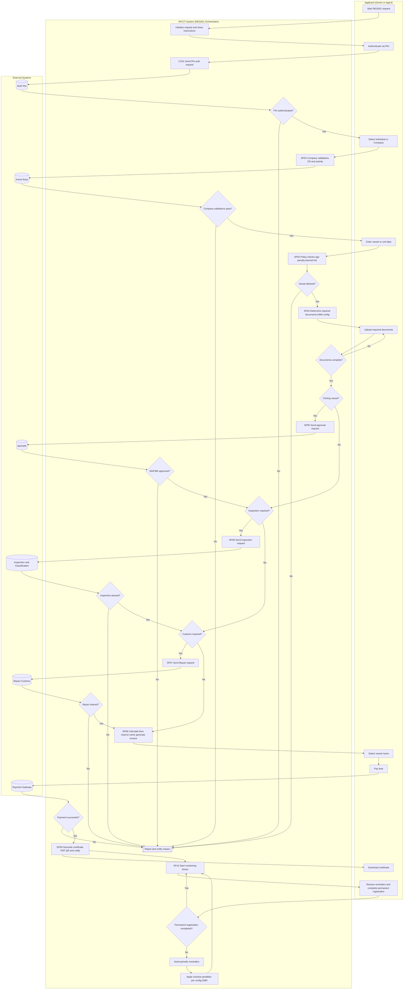

# REG001 – Service Blueprint Swimlane Diagram

## Mermaid Diagram
Swimlane-style diagram using Mermaid `subgraph` lanes.

Scope: REG001 end-to-end journey aligned to CC01 + SP02–SP10.

```mermaid
flowchart TB

%% =====================
%% LANE: Applicant
%% =====================
subgraph L1["Applicant (Owner or Agent)"]
  A0[Start REG001 request]
  A1[Authenticate via PKI]
  A2[Select Individual or Company]
  A3[Enter vessel or unit data]
  A4[Upload required documents]
  A5[Select vessel name]
  A6[Pay fees]
  A7[Download certificate]
  A8[Receive reminders and complete permanent registration]
end

%% =====================
%% LANE: MTCIT System
%% =====================
subgraph L2["MTCIT System (REG001 Orchestrator)"]
  S0[Initialize request and show instructions]
  S1[CC01 Send PKI auth request]
  S2{PKI authenticated?}

  S3[SP02 Company validations CR and activity]
  S4{Company validations pass?}

  S5[SP03 Policy checks age penalty banned list]
  S6{Vessel allowed?}

  S7[SP04 Determine required documents DMN config]
  S8{Documents complete?}

  S9{Fishing vessel?}
  S10[SP05 Send approval request]
  S11{MAFWR approved?}

  S12{Inspection required?}
  S13[SP06 Send inspection request]
  S14{Inspection passed?}

  S15{Customs required?}
  S16[SP07 Send Bayan request]
  S17{Bayan cleared?}

  S18[SP08 Calculate fees reserve name generate invoice]
  S19{Payment successful?}

  S20[SP09 Generate certificate PDF QR and notify]

  S21[SP10 Start monitoring timers]
  S22{Permanent registration completed?}
  S23[Send periodic reminders]
  S24[Apply overdue penalties per config DMN]

  R0[[Reject and notify reason]]
end

%% =====================
%% LANE: External Systems
%% =====================
subgraph L3["External Systems"]
  X1[(ROP PKI)]
  X2[(Invest Easy)]
  X3[(MAFWR)]
  X4[(Inspection and Classification)]
  X5[(Bayan Customs)]
  X6[(Payment Gateway)]
end

%% =====================
%% FLOWS
%% =====================
A0 --> S0
S0 --> A1

%% CC01
A1 --> S1 --> X1
X1 --> S2
S2 -- No --> R0
S2 -- Yes --> A2

%% SP02
A2 --> S3 --> X2
X2 --> S4
S4 -- No --> R0
S4 -- Yes --> A3

%% SP03
A3 --> S5 --> S6
S6 -- No --> R0
S6 -- Yes --> S7

%% SP04
S7 --> A4 --> S8
S8 -- No --> A4
S8 -- Yes --> S9

%% SP05 (conditional)
S9 -- Yes --> S10 --> X3
X3 --> S11
S11 -- No --> R0
S11 -- Yes --> S12
S9 -- No --> S12

%% SP06 (conditional)
S12 -- Yes --> S13 --> X4
X4 --> S14
S14 -- No --> R0
S14 -- Yes --> S15
S12 -- No --> S15

%% SP07 (conditional)
S15 -- Yes --> S16 --> X5
X5 --> S17
S17 -- No --> R0
S17 -- Yes --> S18
S15 -- No --> S18

%% SP08
S18 --> A5 --> A6
A6 --> X6
X6 --> S19
S19 -- No --> R0
S19 -- Yes --> S20 --> A7

%% SP10
S20 --> S21
S21 --> A8
A8 --> S22
S22 -- Yes --> S21
S22 -- No --> S23 --> S24 --> S21

```
