# REG001 – Flowchart With Lane Prefixes (Mermaid)

This diagram avoids Mermaid `subgraph` swimlanes for maximum compatibility.

Legend:
- `AP` = Applicant (Owner or Agent)
- `SYS` = MTCIT System (REG001 Orchestrator)
- `EXT` = External system

```mermaid
flowchart TB

AP_Start[AP Start REG001 request]
SYS_Init[SYS Initialize request and show instructions]
AP_PKI[AP Authenticate via PKI]
SYS_PKI_Send[SYS CC01 Send PKI auth request]
EXT_ROP[EXT ROP PKI]
SYS_PKI_OK{SYS PKI authenticated}
SYS_Reject[SYS Reject and notify reason]

AP_Type[AP Select Individual or Company]
SYS_SP02_Send[SYS SP02 Send CR and activity validation request]
EXT_Invest[EXT Invest Easy]
SYS_SP02_OK{SYS Company validations pass}

AP_Vessel[AP Enter vessel or unit data]
SYS_SP03_Check[SYS SP03 Policy checks age penalty banned list]
SYS_SP03_OK{SYS Vessel allowed}

SYS_SP04_Determine[SYS SP04 Determine required documents DMN config]
AP_Upload[AP Upload required documents]
SYS_SP04_OK{SYS Documents complete}

SYS_Fish{SYS Fishing vessel}
SYS_SP05_Send[SYS SP05 Send approval request]
EXT_MAFWR[EXT MAFWR]
SYS_SP05_OK{SYS MAFWR approved}

SYS_Insp{SYS Inspection required}
SYS_SP06_Send[SYS SP06 Send inspection request]
EXT_Insp[EXT Inspection and Classification]
SYS_SP06_OK{SYS Inspection passed}

SYS_Customs{SYS Customs required}
SYS_SP07_Send[SYS SP07 Send Bayan request]
EXT_Bayan[EXT Bayan Customs]
SYS_SP07_OK{SYS Bayan cleared}

SYS_SP08_Fees[SYS SP08 Calculate fees reserve name generate invoice]
AP_Name[AP Select vessel name]
AP_Pay[AP Pay fees]
EXT_Pay[EXT Payment Gateway]
SYS_SP08_OK{SYS Payment successful}

SYS_SP09_Issue[SYS SP09 Generate certificate PDF QR and notify]
AP_Download[AP Download certificate]

SYS_SP10_Start[SYS SP10 Start monitoring timers]
AP_Reminders[AP Receive reminders and complete permanent registration]
SYS_SP10_Done{SYS Permanent registration completed}
SYS_Remind[SYS Send periodic reminders]
SYS_Penalty[SYS Apply overdue penalties per config DMN]

AP_Start --> SYS_Init --> AP_PKI --> SYS_PKI_Send --> EXT_ROP --> SYS_PKI_OK
SYS_PKI_OK -- No --> SYS_Reject
SYS_PKI_OK -- Yes --> AP_Type --> SYS_SP02_Send --> EXT_Invest --> SYS_SP02_OK
SYS_SP02_OK -- No --> SYS_Reject
SYS_SP02_OK -- Yes --> AP_Vessel --> SYS_SP03_Check --> SYS_SP03_OK
SYS_SP03_OK -- No --> SYS_Reject
SYS_SP03_OK -- Yes --> SYS_SP04_Determine --> AP_Upload --> SYS_SP04_OK
SYS_SP04_OK -- No --> AP_Upload
SYS_SP04_OK -- Yes --> SYS_Fish

SYS_Fish -- Yes --> SYS_SP05_Send --> EXT_MAFWR --> SYS_SP05_OK
SYS_SP05_OK -- No --> SYS_Reject
SYS_SP05_OK -- Yes --> SYS_Insp
SYS_Fish -- No --> SYS_Insp

SYS_Insp -- Yes --> SYS_SP06_Send --> EXT_Insp --> SYS_SP06_OK
SYS_SP06_OK -- No --> SYS_Reject
SYS_SP06_OK -- Yes --> SYS_Customs
SYS_Insp -- No --> SYS_Customs

SYS_Customs -- Yes --> SYS_SP07_Send --> EXT_Bayan --> SYS_SP07_OK
SYS_SP07_OK -- No --> SYS_Reject
SYS_SP07_OK -- Yes --> SYS_SP08_Fees
SYS_Customs -- No --> SYS_SP08_Fees

SYS_SP08_Fees --> AP_Name --> AP_Pay --> EXT_Pay --> SYS_SP08_OK
SYS_SP08_OK -- No --> SYS_Reject
SYS_SP08_OK -- Yes --> SYS_SP09_Issue --> AP_Download --> SYS_SP10_Start --> AP_Reminders --> SYS_SP10_Done

SYS_SP10_Done -- Yes --> SYS_SP10_Start
SYS_SP10_Done -- No --> SYS_Remind --> SYS_Penalty --> SYS_SP10_Start

```

